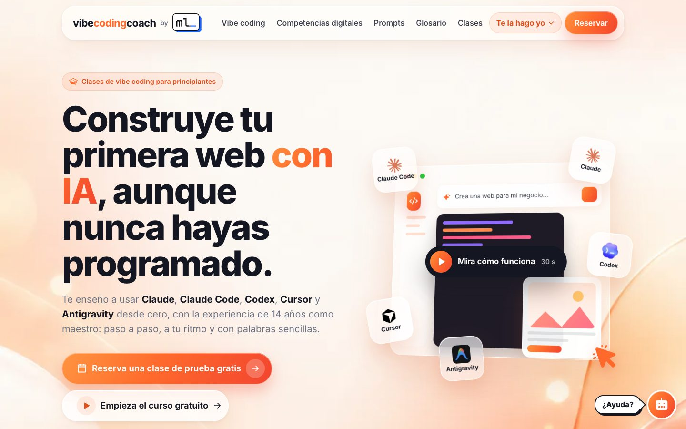

# vibecodingcoach

**Clases de vibe coding para principiantes, cursos gratuitos y webs a medida para pequeños negocios.**

[vibecoding.miguelliebana.com](https://vibecoding.miguelliebana.com) · [cursos.miguelliebana.com](https://cursos.miguelliebana.com)



## Qué hay dentro

- **Dos cursos gratuitos** («Vibe Coding desde Cero» y «Competencias digitales básicas») con lecciones en diapositivas
  que se generan solas desde el contenido, vídeos de YouTube, ejercicios y progreso del alumno guardado en el navegador.
- **Biblioteca de prompts y glosario** con buscador.
- **Calculadora de presupuestos**: estimación de horas, precio y plazo con reglas fijas, y una IA (Google Gemini, en el
  servidor) que rellena el formulario a partir de una descripción libre con salida JSON validada por esquema.
- **Herramienta de encargos** paso a paso: guarda cada encargo en Supabase (tabla de solo inserción con RLS) y avisa por
  email con Resend; si falla uno, basta con el otro.
- **Vídeo generado con código** (Remotion) que se reproduce en la página con las respuestas del visitante.
- **Asistente** que responde dudas sobre horarios, precios y cursos, con límite de peticiones por IP.
- **Catálogo de cursos en su propio subdominio**, servido desde el mismo proyecto con reescrituras por host.
- **SEO**: sitemap y robots generados del contenido, enlaces canónicos y datos estructurados (Course, Article, DefinedTermSet).

## Stack

Next.js 16 (App Router) · React 19 · TypeScript · Supabase · Google Gemini API · Resend · Remotion · GSAP · Vercel

## Cómo está organizado

| Carpeta | Qué contiene |
| --- | --- |
| `src/app` | Páginas y rutas de API (`api/presupuesto`, `api/encargo`, `api/asistente`) |
| `src/content` | Todo el contenido: cursos, glosario, prompts, precios y preguntas del encargo |
| `src/components` | Componentes de la interfaz (calculadora, encargo, reproductor de lecciones…) |
| `media` | Producción de contenido: reels, vídeos de las lecciones y publicación automática en redes |
| `media/remotion` | Proyecto de Remotion para los vídeos hechos con React |

La documentación interna del proyecto está en [CONTEXTO.md](./CONTEXTO.md) y el plan de negocio en [PLAN.md](./PLAN.md).

## Desarrollo

```bash
npm install
npm run dev
```

Abre http://localhost:3000. Las funciones con IA y el encargo necesitan estas variables en `.env.local`:
`GEMINI_API_KEY`, `SUPABASE_URL`, `SUPABASE_PUBLISHABLE_KEY` y `RESEND_API_KEY`. Sin ellas, la web funciona igual y esas
funciones se desactivan o avisan con un mensaje amable.

---

Hecho por [Miguel Liébana](https://miguelliebana.com), maestro durante 14 años y desarrollador web.
